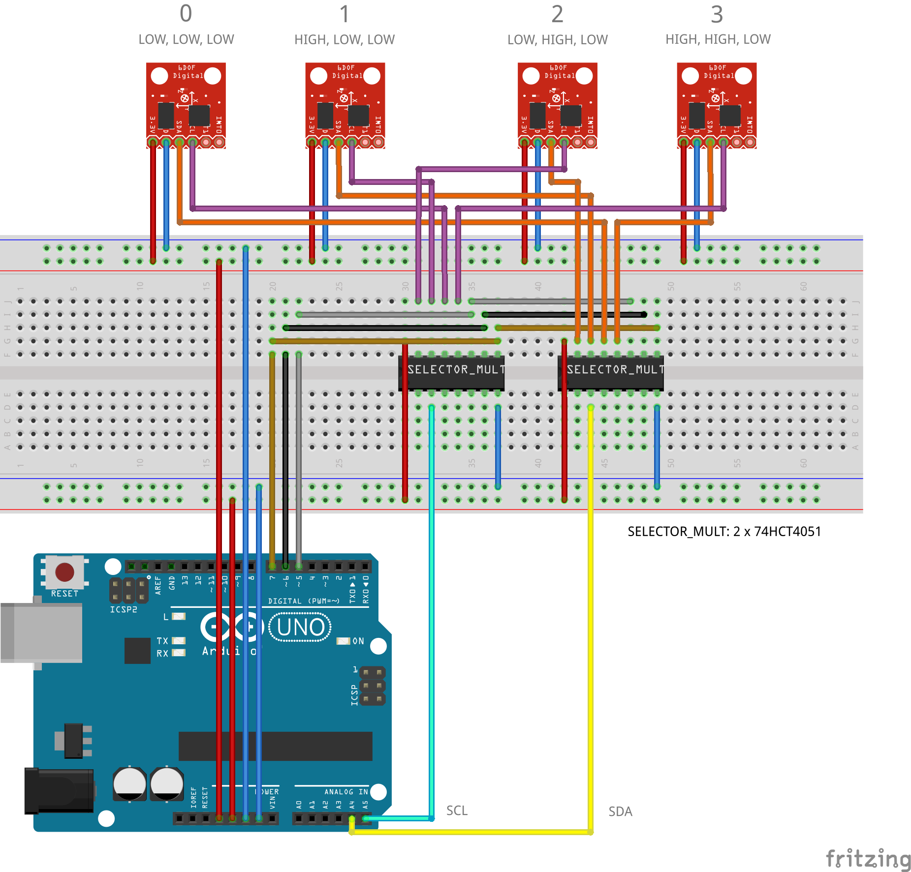
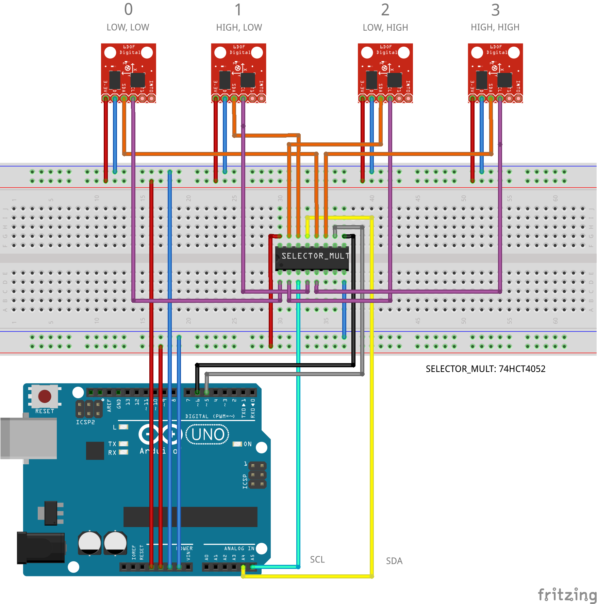

# Arduino-Multiple-MPUs

## Table of Contents

- [About](#about)
- [Dependencies](#dependencies)
- [Usage](#usage)
- [Questions?](#questions)
- [License](#license)

## About

With a [multiplexer](#18-multiplexer) or [high-speed CMOS](#high-speed-cmos) you can use multiple ([more than two](http://playground.arduino.cc/Main/MPU-6050#multiple)) sensors via [I²C](http://en.wikipedia.org/wiki/I%C2%B2C) on [Arduino](http://arduino.cc).

## Dependencies

* Install library [I2Cdev](https://github.com/jrowberg/i2cdevlib/tree/master/EFM32/I2Cdev) by [Jeff Rowberg](https://github.com/jrowberg)
* Install library [MPU6050](https://github.com/jrowberg/i2cdevlib/tree/master/Arduino/MPU6050) by [Jeff Rowberg](https://github.com/jrowberg)

## Usage

### 1/8 Multiplexer

With **two** 1/8 multiplexers ([74HCT4051](https://www.reichelt.de/ICs-74HCT40-DIL/74HCT-4051/3/index.html?ACTION=3&GROUPID=2935&ARTICLE=3393&SEARCH=HCT4051&OFFSET=16&WKID=0&)) you can read **eight** sensors.

Arduino sketch → [multiple-mpus_with-74HCT4051.ino](multiple-mpus_with-74HCT4051/multiple-mpus_with-74HCT4051.ino)

### High-Speed CMOS

With **one** high-speed CMOS ([74HCT4052](https://www.reichelt.de/ICs-74HCT40-DIL/74HCT-4052/3/index.html?ACTION=3&GROUPID=2935&ARTICLE=3394&SEARCH=74HCT%204052&OFFSET=16&WKID=0&)) you can read **four** sensors.

Arduino sketch → [multiple-mpus_with-74HCT4052.ino](multiple-mpus_with-74HCT4052/multiple-mpus_with-74HCT4052.ino)

## Questions?

Don't be shy and feel free to contact me on Twitter: [@darius_morawiec](https://twitter.com/darius_morawiec)

## License

The library is Open Source Software released under the [License](LICENSE).
